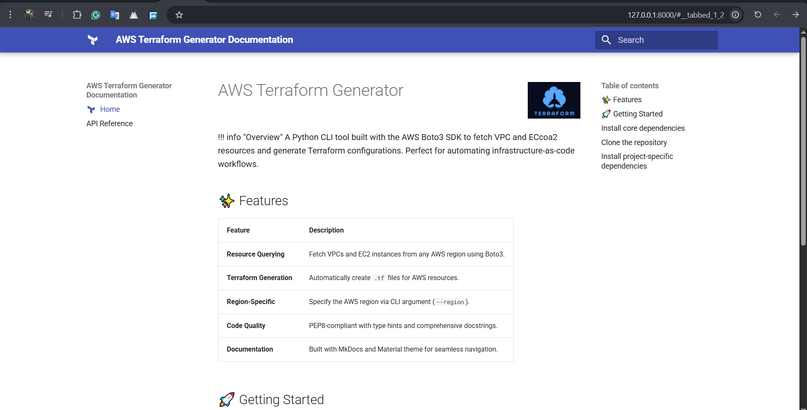
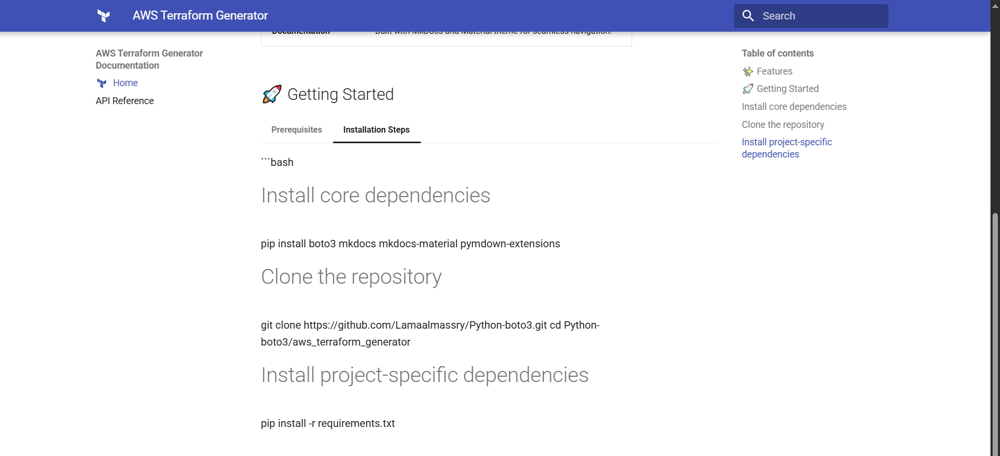

# 🛠️ AWS Terraform Generator

**A Python CLI tool that uses the AWS Boto3 SDK to fetch VPC and EC2 resources and generate Terraform configurations, streamlining infrastructure-as-code workflows.**

---

## ✨ Features

- **Resource Querying**: Fetch VPCs and EC2 instances from any AWS region using Boto3.
- **Terraform Generation**: Automatically create `.tf` files for AWS resources.
- **Region-Specific**: Specify the AWS region via CLI argument (`--region`).
- **Code Quality**: PEP8-compliant with type hints and comprehensive docstrings.
- **Documentation**: Built with MkDocs and Material theme for seamless navigation.

---

## 🚀 Installation

### Prerequisites

- **Python**: 3.8 or higher  
- **AWS Credentials**: Configured in `~/.aws/credentials` with `ec2:DescribeVpcs` and `ec2:DescribeInstances` permissions  
- **Terraform**: Installed to apply generated configurations  
- **Git**: *(Optional)* for cloning the repository  
### Screenshots



### Steps

```bash
# Install core dependencies
pip install boto3 mkdocs mkdocs-material pymdown-extensions

# Clone the repository
git clone https://github.com/Lamaalmassry/Python-boto3.git
cd aws_terraform_generator

# Install project-specific dependencies
pip install -r requirements.txt
