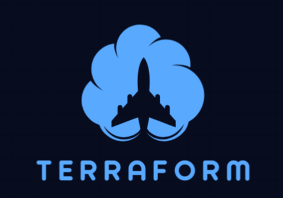

<div style="display: flex; align-items: center; justify-content: space-between;">
  <h1>AWS Terraform Generator</h1>
  
</div>

!!! info "Overview"
    A Python CLI tool built with the AWS Boto3 SDK to fetch VPC and ECcoa2 resources and generate Terraform configurations. Perfect for automating infrastructure-as-code workflows.

## ✨ Features

| Feature | Description |
|---------|-------------|
| **Resource Querying** | Fetch VPCs and EC2 instances from any AWS region using Boto3. |
| **Terraform Generation** | Automatically create `.tf` files for AWS resources. |
| **Region-Specific** | Specify the AWS region via CLI argument (`--region`). |
| **Code Quality** | PEP8-compliant with type hints and comprehensive docstrings. |
| **Documentation** | Built with MkDocs and Material theme for seamless navigation. |

## 🚀 Getting Started

=== "Prerequisites"
    - **Python**: 3.8 or higher
    - **AWS Credentials**: Configured in `~/.aws/credentials` with `ec2:DescribeVpcs` and `ec2:DescribeInstances` permissions
    - **Terraform**: Installed to apply generated configurations
    - **Git**: Optional, for cloning the repository

=== "Installation Steps"
    ```bash
    # Install core dependencies
    pip install boto3 mkdocs mkdocs-material pymdown-extensions

    # Clone the repository (replace with your repo URL)
    git clone <repository-url>
    cd aws_terraform_generator

    # Install project-specific dependencies
    pip install -r requirements.txt